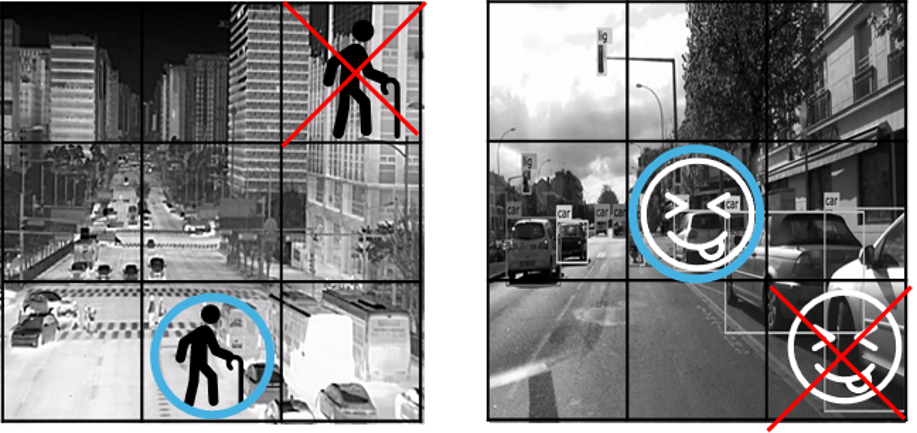
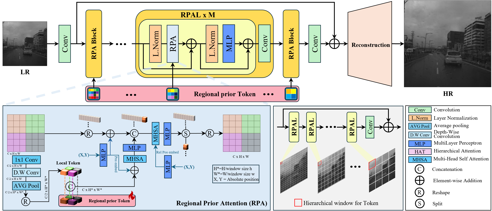

# RPT-SR: Regional Prior Attention Transformer for Infrared Image Super-Resolution

[](https://wacv2026.thecvf.com/)
[](https://arxiv.org/abs/your-paper-link)
[](https://github.com/Yonsei-STL/RPT-SR)

> **RPT-SR: Regional Prior Attention Transformer for Infrared Image Super-Resolution**
> Youngwan Jin, Incheol Park, Yagiz Nalcakan, Hyeongjin Ju, Sanghyeop Yeo, Shiho Kim  
> *WACV 2026 (Winter Conference on Applications of Computer Vision)*

---

## 📖 Abstract

General-purpose super-resolution models, particularly Vision Transformers, exhibit fundamental inefficiencies in common infrared imaging scenarios like surveillance and autonomous driving, which operate from fixed or nearly-static viewpoints. These models fail to exploit the strong, persistent spatial priors inherent in such scenes, leading to **"Structural Amnesia"**.

To address this, we propose the **Regional Prior attention Transformer for infrared image Super-Resolution (RPT-SR)**. Our core contribution is a **Dual-Token Framework** that fuses:
1.  **Regional Prior Tokens:** Learnable tokens acting as a persistent memory for the scene's global structure.
2.  **Local Tokens:** Dynamic tokens capturing frame-specific content.

By explicitly encoding scene layout information into the attention mechanism, RPT-SR achieves state-of-the-art performance across diverse datasets covering both **Long-Wave (LWIR)** and **Short-Wave (SWIR)** spectra.

---

## 🚀 Motivation

<p align="center">
  
</p>

* **Fixed-Viewpoint Inefficiency:** Cameras in CCTV or ADAS often capture scenes with repetitive structures (e.g., roads, buildings).
* **Structural Amnesia:** Existing SR models relearn these static layouts in every frame, wasting computational resources.
* **Our Solution:** RPT-SR memorizes these regional priors to guide the reconstruction, focusing attention on changing details (dynamic features) rather than static backgrounds.

---

## 🏗️ Architecture

<p align="center">
  
</p>

### Regional Prior Attention (RPA)
The core of RPT-SR is the **RPA Block**, which utilizes a dual-token mechanism:
* **Local Token Generation:** Extracted from the input feature map to represent current frame details.
* **Regional Prior Token:** A learnable parameter initialized to capture position-specific scene statistics.
* **Fusion & Attention:** These tokens are fused to modulate the attention map, enabling the model to leverage both static memory and dynamic input.

---

## 📊 Results

RPT-SR achieves **State-of-the-Art (SOTA)** performance on multiple benchmarks.

### Quantitative Comparison (M3FD Dataset - x4)

| Method | LPIPS ↓ | MUSIQ ↑ | MANIQA ↑ | FLOPs (G) | Params (M) |
| :--- | :---: | :---: | :---: | :---: | :---: |
| SwinIR | 0.2070 | 31.8550 | 0.1441 | 192.08 | 11.90 |
| HAT | 0.1118 | 39.6269 | 0.2448 | 345.63 | 20.51 |
| DAT | 0.1084 | 40.2458 | 0.2473 | 245.18 | 14.80 |
| **RPT-SR (Ours)** | **0.1038** | **41.8049** | **0.2621** | **237.78** | **25.83** |

### Cross-Spectral Generalization (RASMD & TNO)

Our model demonstrates broad versatility across different infrared spectra.

| Dataset | Scale | LPIPS (Ours) | Comparison |
| :--- | :---: | :---: | :--- |
| **RASMD (SWIR)** | x4 | **0.1535** | Best (vs. HAT 0.1560) |
| **TNO (LWIR)** | x4 | **0.2501** | Competitive (vs. HAT 0.2475) |


---

## 🔧 Installation

```bash
# Clone the repository
git clone [https://github.com/Yonsei-STL/RPT-SR.git](https://github.com/Yonsei-STL/RPT-SR.git)
cd RPT-SR

# Install dependencies
pip install -r requirements.txt
